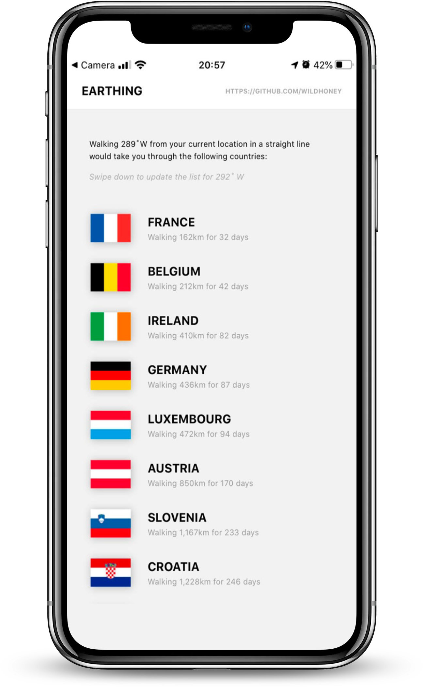

# 🌕 Earthing

> Discover all of the countries along a walking route from your location by a given heading.

&nbsp;

&nbsp;

&nbsp;

&nbsp;

 
 

## Setup

Running `yarn` from the root will setup both the React Native app and the Flask API &ndash; however to run using `yarn start` you'll need to `touch .env` with the `API_URL` equal to `http://0.0.0.0:5000` (or an alternative endpoint), and PostgreSQL envs `DB_HOST`, `DB_NAME`, `DB_USERNAME` and `DB_PASSWORD`.
